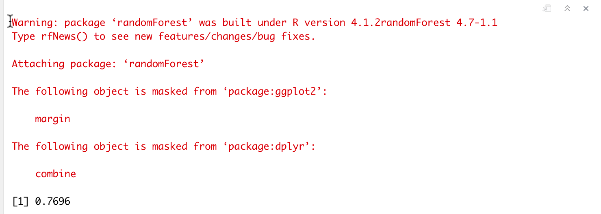

------
**Title: STA 380, Part 2: Exercises**
**Author: Ankit Muthiyan, Disha Gandhi, Kshitij Mahajan**
**Date: 08/12/2022**
**Github link:https://github.com/KshitijMahajan1998/STA-380-Part-2-Assignment-Disha-Ankit-Kshitij**
------

```{r setup, include=FALSE}
knitr::opts_chunk$set(echo = FALSE)
```
## Q1 ~ Probability practice

### Question 1(A)
P(Rc) = 0.3 => P(Tc) = 0.7 

Rc and Tc are mutually exclusive and exhaustive

P('yes'| Rc) = P('no'| Rc) = 0.5

p('yes') = 0.65

Let P('yes'|Tc) = x

Using the rule of total probability,

P('yes') = P('yes',Rc) + P ('yes',Tc)
0.65 = (o.3 * o.5) + (0.7 *x)   #Using Baye's Rule
0.65 - 0.15 = 0.7x
x= 5/7 = 71.4 %

### Question 1(B)

P(Positive|Disease) = 0.993 => P(Negative|Disease) = 0.007

P(Positive|Healthy) = 0.0001 ; P(Negative| Healthy) = 0.9999

P(Disease)=0.000025 ; P(Healthy)= 0.999975

Drawing a tree chart
```{r echo=FALSE, out.width='100%'}

```
                    
However, here we are assuming that the entire population underwent the testing- which is impossible. Hence, we are overestimating the false positives in the denominator.

Hence, the actual P(Disease|Positive) will likely be greater than 0.1988

## Q2 ~ Wrangling the Billboard Top 100

#### PART A 


As per the ask of the question we are supposed to generate a table displaying the top 10 songs as measured by the number of weeks it was present on billboard.
The first column presents **song name**, second column displays **performer name**, and third column displays the **number of weeks that song was present on the billboard**.
We have taken into consideration that the combination of **song and performer should be unique** and the **count is displayed in descending order**.

```{r error=FALSE, warning=FALSE,echo=FALSE}
#loading dplyr library to use all functions in a single groupby
library(dplyr)
#reading the csv and storing it into a df
billboard.df <- read.csv("./data/billboard.csv")
#grouping the df by two columns song and performer (we could have also taken the song_id column but since the question asked both song and performer to be displayed, we use both of these columns in groupby)
#we then use summarize to take the count of entries which is nothing but the number of weeks it is present on billboard and give the column the heading 'count'
billboard.grouped.df <- billboard.df %>% group_by(song,performer) %>% summarise(count = n())
#the third step was to simply sort the df with count column in descending order to display the top songs first
billboard.grouped.arranged.df <- billboard.grouped.df %>%
    arrange(desc(count))
#and now we just filtered the top 10 in that list
billboard.grouped.arranged.df %>% top_n(10)
```
STEPS FOLLOWED IN THE ORDER:

1) Loading Dplyr Library

2) Reading the csv and converting to df

3) Performing GroupBy on song and performer and then taking a count to find total presence on billboard for each song

4) Arranging the count in descending order

5) Displaying the top 10 rows from above table


#### PART B 


As per the ask of the question, we are supposed to report the musical diversity of the billboard for each year. That implies reporting the **unique songs that appeared on the billboard top 100 for each year**. We can see that second column denotes exactly that for each year.

```{r}
#removing songs entries present on billboard in years 1958 and 2021
billboard.filtered.df <- billboard.df[!billboard.df$year %in% c("1958","2021"),]
#loading dplyr library to use all functions in a single groupby
library(dplyr)
#groupby on year and take a unique count of the songs
billboard.diversity.df <- billboard.filtered.df %>% group_by(year) %>% summarise(no_of_unique_songs = n_distinct(song_id))
billboard.diversity.df
```
STEPS FOLLOWED IN THE ORDER:

1) Remove songs from 1958 and 2021

2) Loading Dplyr Library

3) GroupBy on year and take a unique count of the songs

4) Plot the unique song count over the years on x axis


```{r, fig.align='center', echo=FALSE, warning=FALSE}
#plot the unique song count over the years on x axis
library(ggplot2)
ggplot(billboard.diversity.df, aes(x=year, y=no_of_unique_songs)) + geom_line()
```

* We can see from the graph above that there is a **dip in the number of fresh songs in a year starting from the 80's till the previous decade from today**. That's strange because 80's gave us some pretty good songs to dance :) None the less as the data shows, **the dip is very gradual and goes to its lowest in 2001-2002** and takes a **sharp rise later to just increase but is again followed by a sharp decline in 2012-2013**.

* That can be possible because **billboard top 100 was launched in 50's** and during that time there were very **less artists dominating the inudustry and more of struggling artists**. Eventually with 2000's many well known and **talented artists starting coming up because of being found and backed up by top producers** and music industry was shaping up and people were idolizing artists. This might have led to the **increase in diversity**.

#### PART C 


As asked in the question, this plot is to tell us which artists have a 10 week hit implying they had their song on the billboard for atleast 10 weeks. Out of these artists there are 19 artists that have atleast 30 songs in the 10 week hit category. So what we see in the table and in the graph are those 19 artists along with **the number of songs for each that satisfy the two conditions of first being a ten week hit and second the artist having atleast 30 such songs**.

```{r echo=FALSE, fig.align='center', warning=FALSE}
#loading dplyr library to use all functions in a single groupby
library(dplyr)
#grouping by the df with song and performer, applying a summarise on the unique count and filtering the unique combination with count atleast 10.
billboard.ten.week.df <- billboard.df %>% group_by(song,performer) %>% summarise(count = n()) %>% filter(count >=10)
#grouping by the df obtained above by artist and then summarising further the count obtained in above step. Post which we apply a filter that the new summarise count by artist should be atleast 30.
billboard.artists.with.ten.week.df <- billboard.ten.week.df %>% group_by(performer) %>% summarise(song_count = n()) %>% filter(song_count >=30)
billboard.artists.with.ten.week.df
#plotting these 19 artists on the number of songs for each of them.
p<-ggplot(billboard.artists.with.ten.week.df, aes(performer, song_count))
p +geom_bar(stat = "identity") + coord_flip()
```
STEPS FOLLOWED IN THE ORDER:

1) Grouping by the df with song and performer, applying a summarise on the unique count and filtering the unique combination with count atleast 10.
2) Grouping by the df obtained above by artist and then summarising further the count obtained in above step. Post which we apply a filter that the new summarise count by artist should be atleast 30.
3)The 19 artists obtained after this filtering are plotted on a bar graph and inverted with the axis for clarity. The song count is visible on the x axis

## Q3 ~ Visual story telling part 1: green buildings

We do not agree with the findings of on-staff stats guru.

Though guru's inferences sound rational, he just took an average of the rent of non-green buildings and green buildings to then forecast premium rent rates of green buildings. He completely disregarded the 21 other variables that could have been used.

### Simple Linear Regression
```{r 1.slr, echo=FALSE}
df <- read.csv("./data/greenbuildings.csv")
#Data Preprocessing
df$cluster <- as.factor(df$cluster) 
df$renovated <- as.factor(df$renovated)
df$class_a <- as.factor(df$class_a)
df$class_b <- as.factor(df$class_b)
df$LEED <- as.factor(df$LEED)
df$Energystar <- as.factor(df$Energystar)
df$green_rating <- as.factor(df$green_rating)
df$net <- as.factor(df$net)
df$amenities <- as.factor(df$amenities)
attach(df)
linreg <- lm(Rent-cluster_rent~green_rating, data = df)
summary(linreg)$coefficients
```

**Coefficient of Green_Rating: 2.4125; P-Value: 8e-10**

This model has an extremely high bias and has a very low $R^2$. This indicates that this model is fairly inadequate.

### Now we will check whether any cofounding variables are present or not.

```{r 1.slr_summary,echo=FALSE}
confounding_Variables<- colnames(df)[-c(5,12,13,14,23)]
#"Rent","green_rating","LEED","Energystar", "Cluster Rent"
important <- NULL
i <- 0
for(col in confounding_Variables )
{
  i <- i+1
  cat(paste(i,") Multiple Linear Regression, green-building rating with",col),": ")
  mlr<- lm(paste("Rent-cluster_rent~ green_rating+",col), data = df)
  smry <- summary(mlr)
  pval <- smry$coefficients["green_rating1","Pr(>|t|)"]
  
  if(pval > 0.05)
  {
    cat("Confounding\n")
    important <- c(important,col)
  }
  else
  {
    cat("Non Confounding\n")
  }
}
```
From these models, we can conclude that whether a building is in **Class_A** category is  an underlying confounding variable with the _Rent_ and _Green Ratings_

This is rational.Class_A property is the most desirable property.It had an upper hand when compared with another properties in the cluster in terms of amenities, services, and technological aspects. Hence, Class_A listings will obviously cost more.All these factors combined will result in the increase in price and also enhances the chances of property qualifying as a green building.


### Data Pre-processing and Visualization of Data Distribution

A few columns were added to the dataframe to combine multiple redundant columns.Binary continous values were converted to categorical values.

First, several sets of varibles were considered. Then their correlations with the rent and their effect on the rent was observed by plotting different graphs.Secondly, Few graphs were plotted to see the overall distribution of data. 

```{r 1.1, echo=FALSE, warning=FALSE}
library(tidyverse)
library(mosaic)
library(knitr)
library(dplyr)
df <- read.csv("./data/greenbuildings.csv")
#Addition of few columns for Analysis
df$green_rating=ifelse(df$green_rating == 1, "Green", "Non_green")
df$class = ifelse(df$class_a == 1, "Class A", ifelse(df$class_b == 1, "Class B", "Class C"))
df$net=ifelse(df$net == 1, "Net", "Non_Net")
df$greentype = ifelse(df$LEED == 1, "LEED", ifelse(df$Energystar == 1, "Energystar", 0))
hist(df$Rent,breaks=30)
hist(df$leasing_rate,breaks=30)
ggplot(df = df) + 
geom_point(mapping = aes(x = df$leasing_rate, y = df$Rent, color = green_rating))
```

### Convert continous variables into categorical variables.

Convert continous variables such as Age, electricity price and the total degree days so that we can use them for visualization part.
```{r , echo=FALSE, warning=FALSE}
df1 = df %>%
  mutate(agecat = cut(age, c(0,15,30,100)))%>%
  mutate(elecat = cut(Electricity_Costs, c(0,0.01,0.02,0.03,0.05,0.1)))%>%
  mutate(td = cut(total_dd_07, c(0,2000,4000,6000,8000)))
df1 = na.omit(df1)
df1 = subset(df1, !is.na(age))
```
### Data Analysis and Visualization

### Distribution of Green Buidlings across different categories


```{r , echo=FALSE, warning=FALSE}
df2 = df1 %>%
  group_by(agecat) %>%
  summarize(medianrent = median(Rent),percentage = sum(green_rating=='Green')/n(),countof =n())
ggplot(data = df2) + 
  geom_bar(mapping = aes(x=agecat, y=percentage),
           stat='identity', position ='dodge') +
  labs(title="Age of the Building wise Percentage of Green Buildings", 
       y="Percentage of Green Buildings",
       x = "Age of Building in Years")
ggplot(data = df2) + 
  geom_bar(mapping = aes(x=agecat, y=medianrent),
           stat='identity', position ='dodge') +
    labs(title="Age of the Building wise Median Rent per Sqft", 
       y="Median Rent",
       x = "Age of Building in Years")
df3 = df1 %>%
  group_by(class) %>%
  summarize(meanrent = median(Rent),percentage = sum(green_rating=='Green')/n(),countof =n())
ggplot(data = df3) + 
  geom_bar(mapping = aes(x=class, y=percentage),
           stat='identity', position ='dodge') +
labs(title="Class wise Percentage of Green Buildings", 
       y="Percentage of Green Buildings",
       x = "Class")
ggplot(data = df3) + 
  geom_bar(mapping = aes(x=class, y=meanrent),
           stat='identity', position ='dodge') +
labs(title="Class wise Median Rent per Sqdt", 
       y="Median Rent",
       x = "Class")
```


```{r , echo=FALSE, warning=FALSE}
df4 = df1 %>%
  group_by(green_rating, class, agecat) %>%
  summarize(medianrent = median(Rent),countof =n())
ggplot(data = df4) + 
  geom_bar(mapping = aes(x=green_rating, y=countof, fill=agecat),
           stat='identity', position ='dodge') + 
  facet_wrap(~class) + 
  labs(title="Count of units", 
       y="Count of Units",
       x = "Green Rating",
       fill="Age")
ggplot(data = df4) + 
  geom_bar(mapping = aes(x=green_rating, y=medianrent, fill=agecat),
           stat='identity', position ='dodge') + 
  facet_wrap(~class) + 
  labs(title="Distribution of Medianrent per Sqft", 
       y="Medianrent",
       x = "Green Ratings",
       fill="Age")
```
From the graphs it can be concluded that there is no considerable increase in Median rent for the non-green building to green building for Classes A and B across all age groups. This observation is sufficient to negate the conclusion of stats guru. Though his observation was right, it was due to higher percentage of Class A buildings and recent buildings in green rated buildings than solely because of it being a green building. It is recommended that stats guru should sub-divide the analysis across the class of building and age group so that he can improve his flawed suggestion.

### Net Contract Level Analysis
We analysed further to see if there is any relation between the contract type charges and the green buildings.


```{r , echo=FALSE, warning=FALSE}
df3net = df1 %>%
  group_by(green_rating, net) %>%
  summarize(medianrent = median(Rent),countof =n())
ggplot(data = df3net) + 
  geom_bar(mapping = aes(x=green_rating, y=medianrent, fill=net),
           stat='identity', position ='dodge') + 
  
  labs(title="MedianRent vs greenrating at contract level", 
       y="MedianRent",
       x = "Green_Rating",
       fill="Net Contract")
```
In the case of tenants availing net-rental contracts,they end up paying the same median rent for both green and non-green building.
The underlying assumption that green buildings should have lesser difference between net rental contacts and non net rental contracts, being that green building reduce the consumption power accounting to thier ecofriendly design,was not observed. Rather this difference was more significant in the case of green buildings.

### Net Contract Level Analysis with relation to Electricity Prices
We plotted below plots to explore an option of non net contract offering.This can help in the coming years in competitive pricing as the electricity and gas prices hike.To add to this, green building usually consumes lesser electricity and gas.

```{r , echo=FALSE, warning=FALSE}
d3netele = df1 %>%
  group_by(green_rating, net,elecat) %>%
  summarize(meanrent = median(Rent),countof =n())
ggplot(data = d3netele) + 
  geom_bar(mapping = aes(x=elecat, y=meanrent, fill=net),
           stat='identity', position ='dodge') + 
  facet_wrap(~green_rating) + 
  labs(title="Medianrent at Electricity price category level", 
       y="Medianrent",
       x = "Electricity price per Unit",
       fill="Net Contract")
```
The aim was to compare Net Contract to Non Net contract and see if there is any correlation between the electricity charges with the difference between the net contract and non net contract type. 
The difference of rent between the netcontract and non net contract type is higher for Non_green buildings [Electricty bracket of 0.03-0.05]

### Degree Days with Contract rent with Medianrent Comparison
```{r , echo=FALSE, warning=FALSE}
d3netele = df1 %>%
  group_by(green_rating, net,td) %>%
  summarize(meanrent = median(Rent),countof =n())
ggplot(data = d3netele) + 
  geom_bar(mapping = aes(x=td, y=meanrent, fill=net),
           stat='identity', position ='dodge') + 
  facet_wrap(~green_rating) + 
  labs(title="Degreedays category wise Median rent across Contract type", 
       y="Medianrent",
       x = "DegreeDays Category",
       fill="Contract type")
```
With the help of graphs above, we can conclude that the difference betweeen net and non net contracts is higher for Non green buildings.This further emphasizes that the green rated building need less maintenance and tenants end up spending minimal amount for the services.


### GreenRating Vs Medianrent per Sqft
```{r , echo=FALSE, warning=FALSE}
greentype = df1 %>%
  group_by( greentype) %>%
  summarize(meanrent = median(Rent),countof =n())
ggplot(data = greentype) + 
  geom_bar(mapping = aes(x=greentype, y=meanrent),
           stat='identity', position ='dodge') + 
  labs(title="Medianrent at different kinds of Green Rating", 
       y="Medianrent",
       x = "Green Rating Type" )
```
These graphs show the median rent of two different types of green buildings. It is evident that green building with Energystar certification end up getting more rent than leed certified green building.
Hence, if decided to go ahead with green building, green building should be Energystar certified.


### Conclusion
Just constructing a green building might not be sufficient for it to be profitable. We need to consider several other factors to make this plan profitable.Those points are as follow:
1. Building should be energystar certified.
2. It should be rented out as Non net contract.
3. Tenant should be charged for utilities at the market rates.
This ensures that company could make money on the utilities charge and compensate for the initial investment in the coming years as the electricity and gas prices tend to hike.

## Q4 ~ Visual story telling part 2: Capital Metro data

* Total hourly boarding and alighting for weekdays and weekends:
```{r, warning=FALSE, message=FALSE, echo=FALSE}
library(dplyr)
#metro = read.csv('./data/capmetro_UT.csv')
metro = read.csv('./data/capmetro_UT.csv')
hour = metro %>% group_by(hour_of_day, weekend) %>%
  summarise(boarding = sum(boarding), alighting = sum(alighting))
hour
```

```{r, warning=FALSE, message=FALSE, echo=FALSE}
weekday = filter(hour, weekend == 'weekday')
weekday$boarding = weekday$boarding/65
weekday$alighting = weekday$alighting/65

weekend = filter(hour, weekend == 'weekend')
weekend$boarding = weekend$boarding/26
weekend$alighting = weekend$alighting/26

#print(as_tibble(weekday), n=Inf)
#print(as_tibble(weekend), n=Inf)
```

* Average hourly boarding and alighting:
```{r, warning=FALSE, message=FALSE, echo=FALSE,fig.align="center"}
plot(weekday$hour_of_day, weekday$boarding, type="l", col='red', xlab='hour_of_day', ylab='Average Boarding', main="Average hourly boarding on Weekdays and Weekends")
lines(weekend$hour_of_day, weekend$boarding, type="l", col='green')
legend(x = "topright", legend = c("Weekday", "Weekend"), lty = c(1, 1), col = c("red", "green"), lwd = 2)
```
* On weekdays, the average boarding peaks at hour 4-5 PM, which is 525
* This makes sense as students will be heading back after classes
* The boarding on weekends is considerably lower, the maximum is between 5-7 PM

```{r, warning=FALSE, message=FALSE, echo=FALSE,fig.align="center"}
plot(weekday$hour_of_day, weekday$alighting, type="l", col='red', xlab='hour_of_day', ylab='Average Alighting', main="Average hourly alighting on Weekdays and Weekends")
lines(weekend$hour_of_day, weekend$alighting, type="l", col='green')
legend(x = "topright", legend = c("Weekday", "Weekend"), lty = c(1, 1), col = c("red", "green"), lwd = 2)
```
* On weekdays, the average alighting peaks at 9-10 AM, which is 628
* This can be explained as students will be coming to classes from their homes
* The alighting on weekends is again considerably lower, the maximum is at 3-4 PM

* Checking boarding and alighting trends across the weeks:
```{r, warning=FALSE, message=FALSE, echo=FALSE,fig.align="center"}
metro$week = format(as.Date(metro$timestamp), "%W")
#plot(aggregate(metro$boarding, by=list(metro$week), FUN=sum), col='red')

weekly = aggregate(cbind(metro$boarding, metro$alighting), by=list(metro$week), FUN=sum)
#weekly
plot(weekly$Group.1, weekly$V1, type="l", col='red', xlab='Week of the year', ylab='Boarding / Alighting', main="Weekly Boarding and Alighting")
lines(weekly$Group.1, weekly$V2, type="l", col='green')
legend(x = "bottomright", legend = c("Boarding", "Alighting"), lty = c(1, 1), col = c("red", "green"), lwd = 2)

#plot(metro$week, metro$boarding, type="l", col='red')
#plot(metro$week, metro$alighting, type="l", col='blue')
```
* There is a sharp drop in ridership during week 47 (Nov 18-24, 2018). This corresponds to the Thanksgiving Week!
* Thanksgiving was on Thursday, November 22, 2018
* For the first week (Week 35) the data is only captured for 1 day, hence the low ridership

## Q5 ~ Portfolio modeling

Following is the list of ETF's I considered for making three portfolio's for comparison and analyzing. Our idea on making portfolios was based on type of ETF's rather than sectors and so we have mixed sectors but a different combination of type of ETF's. This is because even if one sector gets affected due to any natural/climatic/environmental issue, other investments in the same portfolio will balance it out. And also we will come to know which type of ETF's benefit the most.

##### **PORTFOLIO 1**


The focus for this portfolio is on **Large Cap Growth Equities** and large investment with slow but high returns. This portfolio is preferable for people who are risk averse and chances of profit here are extremely high.

**1) VOO: Vanguard S&P 500**
  This is based on S&P index and includes companies listed majorly in tech. It is diversified and has equities of 500 such high floating companies.
  
**2) QQQ: Invesco Trust**
  This is based on Nasdaq index and includes stocks from major tech companies listed on world's most popular index.  It has a high volume of trades on a daily basis that makes it easy to rely on.
  
**3) SPY: SPDR S&P 500**
  This is again based on S&P index and is one of the most largest, heavily traded and most liquid ETF. It is a heavy investment but it is very popular making it a safe bet.
  
**4) CCOR: Core Alternative**
  In this category of ETF's, this one is quite cheap and hence can help in balancing the investment. And also this ETF is very diversified across all sectors making it a safe blind bet.
  
**5) IVV: iShares Core S&P 500 ETF**
  This one is isued by BlackRock which has a very influential portfolio and is again based on S&P index. It has a huge volume too but the investment is quite high. The avg return is relatively high compared to other ETF's in the same category.

```{r, error=FALSE, warning=FALSE}

#loading libraries
library(quantmod, warn.conflicts = FALSE, quietly = TRUE)
library(PerformanceAnalytics, warn.conflicts = FALSE, quietly = TRUE)

#launching etf dataframes using tickers, by default the data source is yahoo
portfolio1.tickers.etf = c("VOO","QQQ","SPY","CCOR","IVV")
portfolio1.tickers.returns = getSymbols(portfolio1.tickers.etf, from = "2017-08-08")

#adjusting OHLC with any split or dividend returns to add it to previously observed returns using function adjustOHLC
for(ticker in portfolio1.tickers.etf) {
	expr = paste0(ticker, "a = adjustOHLC(", ticker, ")")
	eval(parse(text=expr))
}

head(QQQa)
```

* To start building our portfolio in R, we used getSymbols method to load the tickers with respective returns and generate a dataframe for each ETF.

* We then operated on the same dataframe to adjust for OHLC (Open,High,Low,Close) returns with any split and dividend returns for that day using adjustOHLC function.

* Above is QQQ ETF with it's first five rows showing how the returns look like for each day, with each row representing each day.

* By default the data source is yahoo.

```{r, error=FALSE, warning=FALSE}
#using cbind to get the percentage of change in returns and then removing null values
all.returns = cbind(ClCl(VOOa),ClCl(QQQa),ClCl(SPYa),ClCl(CCORa),ClCl(IVVa))
all.returns = as.matrix(na.omit(all.returns))
head(all.returns)

```

* This is how the returns look like when computed via a percentage change.

* We will now sample any day out of the available data for a 20 day trading period and simulate this exercise for about 5000 times which is nothing but bootstap resampling to track how our wealth changes and what returns and var we get.

* We have taken initial wealth to be 100,000 and a 20 day trading period as mentioned in the question. And the weightage allocated between these 5 ETF's is 12.5%, 25%, 25%, 25%, 12.5% respectively in the order above.

```{r}
library(foreach)
library(mosaic)

#initializing the wealth at the start to be 100000 as mentioned in the question
initial.wealth = 100000

#performing bootstrap simulation
sim.portfolio1 = foreach(i=1:5000, .combine='rbind') %do% {
	total.wealth = initial.wealth
	weights = c(0.125, 0.25, 0.25, 0.25, 0.125)
	holdings = weights * total.wealth
	n.days = 20
	wealthtracker = rep(0, n.days)
	for(today in 1:n.days) {
		return.today = resample(all.returns, 1, orig.ids=FALSE)
		holdings = holdings + holdings*return.today
		total.wealth = sum(holdings)
		wealthtracker[today] = total.wealth
	}
	wealthtracker
}

#profit/loss and VAR calculation
portfolio1.mean = mean(sim.portfolio1[,n.days]) - initial.wealth
portfolio1.var = quantile(sim.portfolio1[,n.days],.05) - initial.wealth
portfolio1.upper = quantile(sim.portfolio1[,n.days],.95) - initial.wealth

#plotting the returns 
hist(sim.portfolio1[,n.days] - initial.wealth, breaks=30, xlim = range(-30000, 30000), ylim = range(0, 1000), main = "Portfolio 1", xlab = "Total Returns")

print(paste('The VAR observed in portfolio 1 is ', portfolio1.var))
print(paste('The average estimated return observed in portfolio 1 is ', portfolio1.mean))
print(paste('The upper bound to return observed in portfolio 1 is ', portfolio1.upper))
```


##### **PORTFOLIO 2**


The focus for this portfolio is on **Corporate and Treasury Bonds** and steady returns on a long term basis. They might not be quick like short cap market ETF's but have a guaranteed return irrespective of the movement of stock market.

**1) VCSH: Vanguard Short Term Corporate Bond**
  This ETF is based on corporate bonds and is known for it's large volume and short term investment. It is tracking investments in Bloomberg index.
  
**2) IBDN: iShares iBonds Dec 2022 Corporate Bond**
  This ETF also shares the same trait as VCSH but is very cheaper compared to VCSH. It has really good returns and YTD.
  
**3) SPSB: SPDR Portfolio Short Term Corporate Bond**
  This ETF is based on corporate bonds and is known for it's large volume and high liquidity. It is tracking investments in Bloomberg index.
  
**4) HYG: iShares iBoxx $ High Yield Corporate Bond**
  The benefits from this ETF depends on the knowledge of the investor and their willingness to take risk. The profit or loss will depend on the market and volume.
  
**5) VCIT: Vanguard Intermediate-Term Corporate Bond**
  This has a medium length term for investment and is very cost efficient to other ETF's in the same category. It is again based on Bloomberg index like it's peers.
  
```{r, error=FALSE, warning=FALSE}

#launching etf dataframes using tickers, by default the data source is yahoo
portfolio2.tickers.etf = c("VCSH","IBDN","SPSB","HYG","VCIT")
portfolio2.tickers.returns = getSymbols(portfolio2.tickers.etf, from = "2017-08-08")

#adjusting OHLC with any split or dividend returns to add it to previously observed returns using function adjustOHLC
for(ticker in portfolio2.tickers.etf) {
	expr = paste0(ticker, "a = adjustOHLC(", ticker, ")")
	eval(parse(text=expr))
}

head(VCSHa)
```

* Above is VCSH ETF with it's first five rows showing how the returns look like for each day, with each row representing each day.

```{r, error=FALSE, warning=FALSE}

#using cbind to get the percentage of change in returns and then removing null values
all.returns = cbind(ClCl(VCSHa),ClCl(IBDNa),ClCl(SPSBa),ClCl(HYGa),ClCl(VCITa))
all.returns = as.matrix(na.omit(all.returns))
head(all.returns)
```

* This is how the returns look like when computed via a percentage change.

* We will now sample any day out of the available data for a 20 day trading period and simulate this exercise for about 5000 times which is nothing but bootstap resampling to track how our wealth changes and what returns and var we get.

* We have taken initial wealth to be 100,000 and a 20 day trading period as mentioned in the question. And the weightage allocated between these 5 ETF's is 25%, 25%, 25%, 12.5%, 12.5% respectively in the order above.

```{r}

#initializing the wealth at the start to be 100000 as mentioned in the question
initial.wealth = 100000

#performing bootstrap simulation
sim.portfolio2 = foreach(i=1:5000, .combine='rbind') %do% {
	total.wealth = initial.wealth
	weights = c(0.25, 0.25, 0.25, 0.125, 0.125)
	holdings = weights * total.wealth
	n.days = 20
	wealthtracker = rep(0, n.days)
	for(today in 1:n.days) {
		return.today = resample(all.returns, 1, orig.ids=FALSE)
		holdings = holdings + holdings*return.today
		total.wealth = sum(holdings)
		wealthtracker[today] = total.wealth
	}
	wealthtracker
}

#profit/loss and VAR calculation
portfolio2.mean = mean(sim.portfolio2[,n.days]) - initial.wealth
portfolio2.var = quantile(sim.portfolio2[,n.days],.05) - initial.wealth
portfolio2.upper = quantile(sim.portfolio2[,n.days],.95) - initial.wealth

#plotting the returns 
hist(sim.portfolio2[,n.days] - initial.wealth, breaks=30, xlim = range(-30000, 30000), ylim = range(0, 1000), main = "Portfolio 2", xlab = "Total Returns")

print(paste('The VAR observed in portfolio 2 is ', portfolio2.var))
print(paste('The average estimated return observed in portfolio 2 is ', portfolio2.mean))
print(paste('The upper bound to return observed in portfolio 2 is ', portfolio2.upper))
```

##### **PORTFOLIO 3**


The focus for this portfolio is on **Large Cap Blend Equities** awhich are index focussed and only deal with large cap equities. This type is assigned to portfolios where neither growth nor value characteristics dominate and it represents the overall US market in terms of proportion make us inclined towards investing in this and studying it.

**1) SCHD: Schwab US Dividend Equity**
  This is based on the very famous Dow Jones index and is well known for the stable returns.
  
**2) SPLG: SPDR Portfolio S&P 500**
  It is based on S&P 500 index and is world wide known.
  
**3) VTV: Vanguard Value**
  The companies included in this ETF are very stable and safe. On top of it, this is very diverse at some of the lowest prices with good returns.
  
**4) IWD: iShares Russell 1000 Value**
  This ETF is tilted towards financial companies and has a large cap of companies even greater than 650. They tend to be heavy on securities and occupy a large portion in portfolios.


```{r, warning=FALSE}
#launching etf dataframes using tickers, by default the data source is yahoo
portfolio3.tickers.etf = c("SCHD","SPLG","VTV","IWD")
portfolio3.tickers.returns = getSymbols(portfolio3.tickers.etf, from = "2017-08-08")

#adjusting OHLC with any split or dividend returns to add it to previously observed returns using function adjustOHLC
for(ticker in portfolio3.tickers.etf) {
	expr = paste0(ticker, "a = adjustOHLC(", ticker, ")")
	eval(parse(text=expr))
}

head(SCHDa)
```

* Above is SCHD ETF with it's first five rows showing how the returns look like for each day, with each row representing each day.

```{r}
#using cbind to get the percentage of change in returns and then removing null values
all.returns = cbind(ClCl(SCHDa),ClCl(SPLGa),ClCl(VTVa),ClCl(IWDa))
all.returns = as.matrix(na.omit(all.returns))
head(all.returns)
```

* This is how the returns look like when computed via a percentage change.

* We will now sample any day out of the available data for a 20 day trading period and simulate this exercise for about 5000 times which is nothing but bootstap resampling to track how our wealth changes and what returns and var we get.

```{r}

#initializing the wealth at the start to be 100000 as mentioned in the question
initial.wealth = 100000

#performing bootstrap simulation
sim.portfolio3 = foreach(i=1:5000, .combine='rbind') %do% {
	total.wealth = initial.wealth
	weights = c(0.2, 0.2, 0.3, 0.3)
	holdings = weights * total.wealth
	n_days = 20
	wealthtracker = rep(0, n.days)
	for(today in 1:n.days) {
		return.today = resample(all.returns, 1, orig.ids=FALSE)
		holdings = holdings + holdings*return.today
		total.wealth = sum(holdings)
		wealthtracker[today] = total.wealth
	}
	wealthtracker
}

#profit/loss and VAR calculation
portfolio3.mean = mean(sim.portfolio3[,n.days]) - initial.wealth
portfolio3.var = quantile(sim.portfolio3[,n.days],.05) - initial.wealth
portfolio3.upper = quantile(sim.portfolio3[,n.days],.95) - initial.wealth

#plotting the returns 
hist(sim.portfolio3[,n.days] - initial.wealth, breaks=30, xlim = range(-30000, 30000), ylim = range(0, 1000), main = "Portfolio 3", xlab = "Total Returns")

print(paste('The VAR observed in portfolio 3 is ', portfolio3.var))
print(paste('The average estimated return observed in portfolio 3 is ', portfolio3.mean))
print(paste('The upper bound to return observed in portfolio 3 is ', portfolio3.upper))
```

* What we observe in the above results as obtained from all three portfolios is that the **Value at Risk is lowest for Portfolio 2** and **highest for Portfolio 3**. So a **risk averse person would choose Portfolio 2** and a **risk taking person would be inclined towards Portfolio 3.**

* **The average estimated returns from Portfolio 3 is the highest as compared to Portfolio 1 and 2** but when comparing it with VaR we can see that even though Portfolio 3 has great returns the risk associated with it is high and so **a risk averse person would probably be happy with less returns and less risk.** But a risk taking person would be encouraged by the high returns and be motivated to take such a high amount of risk because as you can see the difference in VaR is also very high in between them.

* The upper bound return is very high for Portfolio 1 and 3 which goes in proportion to other parameters and says a lot about how **Portfolio 3 is beneficial in best returns but just that it is very risky.**

* Portfolio 1 has a very normal distribution curve for returns compared to the skewed graphs for Portfolio 2 and 3 which makes us favor Portfolio 3 a little less. And since **Portfolio 2 has a left skewed graph, the lower VaR becomes obvious.**

* We chose Large Cap Blend Equities in Portfolio 3 which cover the whole stock market with proportion to size and growth and hence this ETF is more diversified implying large risk which is also proven by the results we observed above. And Portfolio 2 is about corporate bonds which are short term less risky investments. Since they also have treasury bonds in it, the low risk is automatically implied.

## Q6 ~ Clustering and PCA

## To start with the problem, we performed following steps.
1.Importred the necessary libraries.
2.Loaded the dataset in a dataframe called "winedf".
3. As we are going to perform the unsupervised learning algorithm, dataset should be unlabeled. Hence, we removed the last two columns from the dataset, which were dependant varibales.
4. We performed factoring  relavant factor variable such as quality.
5.Scaled the numeric data to mean = 0 and s.d = 1

```{r, include=FALSE, warnings=FALSE, messages=FALSE,echo=FALSE}
library(ggplot2)
set.seed(512)
wine = read.csv('./data/wine.csv', header=TRUE)
```

```{r,include=FALSE, warnings=FALSE, messages=FALSE,echo=FALSE}
wine$quality = as.factor(wine$quality)
wine_dim=wine[,c(1:11)]
```

```{r,include=FALSE, warnings=FALSE, messages=FALSE,echo=FALSE}
wine_dim = scale(wine_dim, center=TRUE, scale=TRUE)
```

## We selected K-Means algorithm as a clustering algorithm. The K-Means algorithm has 2 centers and 50 random initial centroids.


```{r,include=FALSE, warnings=FALSE, messages=FALSE,echo=FALSE}
clust1 = kmeans(wine_dim, 2, nstart=500)
```

### This is the plot of result of the K-Means clustering algorithm on two clusters.

```{r,warnings=FALSE, messages=FALSE,echo=FALSE}
qplot(color, fill=factor(clust1$cluster), data = wine)
```

From the graph,we can observe what the k-means clustering algorithm have clustred in cluster 1 and 2.We can also see the wine type, whether it's red or white.
We can conclude that, attributes in cluster 1 are most likely corresponding to red wine properties, and attributes of cluster 2  are most likely corresponding to the white wine properties.  

### We have represented the above plot in the tabular form.

```{r ,warnings=FALSE, messages=FALSE,echo=FALSE}
t1=table(wine$color, clust1$cluster)
t1
```

We can treat this table as a confusion matrix to calculate the accuracy of the K-Means algorithm. Cluster 1 clusterd 4854 wines and Cluster 2 clustered 1643 wines in total.
But, cluster 1 clustered 24 wines inaccurately. On the other hand, cluster 2 clustered 68 wines inaccurately.

### We further implemented the probablity table of the above result.

```{r,warnings=FALSE, messages=FALSE,echo=FALSE}
p1 = prop.table(t1, margin = 1)
p1
```

Accuracy of cluster 1 is 98.61 percent and accuracy of cluster 2 is 98.49 percent.

## Now, we will apply PCA on the given wine dataset

### This plot shows the first two Principal Components along with the datapoints.

```{r,warnings=FALSE, messages=FALSE,echo=FALSE}
pcomps = prcomp(wine_dim)
loadings = pcomps$rotation
scores = pcomps$x
qplot(scores[,1], scores[,2],col=wine$color,xlab='Component 1', ylab='Component 2')
```

From the above graph, we can see that there are two groupings with some overlap, between the two principal components. 
We can conclude that, first two principal components satisfactorily identify the wine type at the expense of some minimal missclassification.

###  Let's plot first component against count.
```{r,warnings=FALSE, messages=FALSE,echo=FALSE}
qplot(scores[,1], fill=wine$color, xlab='Component 1', ylab='Count')
```

From the above graph, we can see that just the first principle component does a decent job at identifying two groups and  predicting the wine type.
However, two principal components capture the groups well, as seen above.

### Both K-Means clustering algorithm and PCA can be implemented to classify wine into two types- red or white.

## Now,let's check if K-Means clustering algorithm and PCA are capable of distinguishing the higher quality wines from the lower quality wines.

## First, we will implement K-Means clustering algorithm.The K-Means algorithm has 2 centers and 50 random initial centroids.

```{r messages=FALSE,echo=FALSE,include=FALSE,warning=FALSE}
set.seed(512)
clust2 = kmeans(wine_dim, 10, nstart=50)
```

### This is the plot of result of the K-Means clustering algorithm on 10 clusters.

```{r,warnings=FALSE, messages=FALSE,echo=FALSE}
qplot(quality, fill=factor(clust2$cluster), data = wine)
```

For distingusihing higher quality wines from lowe quality wines, the K-means algorithm does not seem capable of classifying the wines accurately. 
It clusters each of the distinct quality wines into different clusters, which are not representative of the clusters.

### We have represented the above plot in the tabular form.

```{r,warnings=FALSE, messages=FALSE,echo=FALSE}
t2=table(wine$quality, clust2$cluster)
t2
```

From this table, we can conclude that K-Mean clustering algorithm is pretty inaccurate in classifying the wine on basis of quality.
We can see a very distributed grouping of wine quality amongst the indentified 10 clusters. 

### We further implemented the probablity table of the above result.

```{r}
p2 = prop.table(t2, margin = 1)
p2
```

Above table represents the probabalistic accuracy of the clusters.
We are not acheiving good accuracy scores for any quality within any cluster.

### K means clustering is not capable of distinguishing the higher quality wines from the lower quality wines.

## Now,let's check if PCA is capable of distinguishing the higher quality wines from the lower quality wines.

## Now, we will apply PCA on the given wine dataset

### This plot shows the first two Principal Components along with the datapoints.

```{r}
pcomps = prcomp(wine_dim)
loadings = pcomps$rotation
scores = pcomps$x
qplot(scores[,1], scores[,2], xlab='Component 1', ylab='Component 2')
```


### From the above graph, we can see that there are two groupings with some overlap, between the two principal components. 

### We can superimpose the original qualities of the wine onto the above two Principal Components to see if the groupings can be used to identify quality of wines.

```{r}
qplot(scores[,1], scores[,2], col=wine$quality, xlab='Component 1', ylab='Component 2')
```

### From the above graph, we can see that two principal components are not capable of distinguishing the higher quality wines from the lower quality wines.


## Finally we can draw following conclusions:
1.Both K-Means clustering and PCA methods are capable of distinguishing the red wines from the white wines.
2.Both K-Means clustering and PCA methods are not capable of distinguishing the higher quality wines from the lower quality wines.
3.For this dataset, PCA makes more sense to us for two reasons:
     1.PCA is able to characterize the attributes which give each type of wine its properties.
     2.K-Means clustering algorithm would not give desirable results with the variation of K value.

## Q7 ~ Market segmentation

```{r, warning=FALSE, message=FALSE, echo=FALSE}
social = read.csv('./data/social_marketing.csv', row.names=1)
dim(social)
#7882   37

```
* Data has 7882 rows with 37 columns

```{r, warning=FALSE, message=FALSE, echo=FALSE}
#boxplot(social$spam)
#boxplot(social$adult)
```
* There are not many spam tweets
* Removing probable bots based on adult tweets

```{r, warning=FALSE, message=FALSE, echo=FALSE}
# Q1 = quantile(social$adult, .25)
# Q3 = quantile(social$adult, .75)
# IQR = IQR(social$adult)
cutoff = quantile(social$adult, .99)
clean = subset(social, social$adult < cutoff)
dim(clean)
#7786   37
#boxplot(clean$adult)
```
* Cleaned data contains 7786 rows. 96 probable bots removed

* Now scaling the data and running K-means clustering to get market segments
* Computing and plotting wss for K = 2 to 20
```{r, warning=FALSE, message=FALSE, echo=FALSE,fig.align="center"}

clean = scale(clean, center=TRUE, scale=TRUE)
#clean
set.seed(1)
max = 20
wss = sapply(1:max, function(k){kmeans(clean, k, nstart=25, iter.max = 15 )$tot.withinss})
plot(1:max, wss, type="b", pch = 19, frame = FALSE, 
     xlab = 'Number of clusters', ylab = 'Total within-clusters sum of squares')
```

* Plotting SSE grid:
```{r, warning=FALSE, message=FALSE, echo=FALSE,fig.align="center"}
library(foreach)
k_grid = seq(2, 20, by=1)
SSE_grid = foreach(k = k_grid, .combine = 'c') %do% {
  cluster_k = kmeans(clean, k, nstart = 25, iter.max = 15)
  cluster_k$tot.withinss
}
plot(SSE_grid)
```

```{r, warning=FALSE, message=FALSE, echo=FALSE,fig.align="center"}
library(cluster)
#clusGap(x = clean, FUNcluster = kmeans, K.max = 10, B = 20, nstart = 25)
#clusGap
knitr::include_graphics('./images/Market.jpeg')
```
* Based on standard error and previous plots, we choose n_clusters = 7

```{r, warning=FALSE, message=FALSE, echo=FALSE,fig.align="center"}
# Extract the centers and scales from the scaled data
mu = attr(clean,"scaled:center")
sigma = attr(clean,"scaled:scale")

# # Run k-means with 7 clusters and 25 starts
# clust1 = kmeans(clean, 7, nstart=25)
# clust1$center

# social_combined = cbind(clean, clust1$cluster)
# cluster_centers = clust1$center
# clusplot(clean, clust1$cluster, color=TRUE, shade=TRUE,labels=5, lines=0)

# #Understanding the clusters
# social_clust = rbind(clust1$center[1,]*sigma + mu,clust1$center[2,]*sigma + mu,clust1$center[3,]*sigma + mu,clust1$center[4,]*sigma + mu,clust1$center[5,]*sigma + mu,clust1$center[6,]*sigma + mu,clust1$center[7,]*sigma + mu)
# social_clust = data.frame(social_clust)
# social_clust
# 
# val = data.frame(t(social_clust))
# names(val)
# 
# cluster1 = val[order(val$X1 ,decreasing=T)[1:5],]
# cluster1d = val[order(val$X1 ,decreasing=F)[1:5],]
# barplot(cluster1$X1, main="CLUSTER 1", xlab="TOP CATEGORIES", ylab="FREQ", names.arg=row.names(cluster1),
#         border="red")
# barplot(cluster1d$X1, main="CLUSTER 1", xlab="BOTTOM CATEGORIES", ylab="FREQ", names.arg=row.names(cluster1d),
#         border="red")
```

* Running k-means++ with 7 clusters:
```{r, warning=FALSE, message=FALSE, echo=FALSE}

library('ClusterR')

kpp = KMeans_rcpp(clean, clusters=7, num_init = 1, max_iters = 10, initializer = "kmeans++", fuzzy = FALSE, verbose = FALSE, CENTROIDS = NULL, tol = 1e-04, tol_optimal_init = 0.3, seed = 1)
```

* Analyzing the clusters:
```{r, warning=FALSE, message=FALSE, echo=FALSE}
knitr::kable(head(sort((kpp$centroids[1,]*sigma + mu), decreasing=TRUE)), digits = 1)
```
** Cluster1: chatter, politics, news, sports_fandom, photo_sharing, health_nutrition
** Count = 555
** Politically active and opinionated


```{r, warning=FALSE, message=FALSE, echo=FALSE}
knitr::kable(head(sort((kpp$centroids[2,]*sigma + mu), decreasing=TRUE)), digits = 1)
```
** Cluster2: chatter, photo_sharing, health_nutrition, cooking, sports_fandom, politics
** Count = 3683; this is the largest cluster
** Photo sharing, Health, nutrition and cooking enthusiasts


```{r, warning=FALSE, message=FALSE, echo=FALSE}
knitr::kable(head(sort((kpp$centroids[3,]*sigma + mu), decreasing=TRUE)), digits = 1)
```
** Cluster3: health_nutrition, chatter, personal_fitness, cooking, photo_sharing, politics
** Count = 426
** Similar to Cluster2, more into nutrition and fitness


```{r, warning=FALSE, message=FALSE, echo=FALSE}
knitr::kable(head(sort((kpp$centroids[4,]*sigma + mu), decreasing=TRUE)), digits = 1)
```
** Cluster4: health_nutrition, chatter, personal_fitness, cooking, photo_sharing, politics
** Count = 926
** Same top features, can be clubbed with cluster3


```{r, warning=FALSE, message=FALSE, echo=FALSE}
knitr::kable(head(sort((kpp$centroids[5,]*sigma + mu), decreasing=TRUE)), digits = 1)
```
** Cluster5: politics, travel, chatter, health_nutrition, photo_sharing, news
** Count = 353
** Travelers, and politically inclined

```{r, warning=FALSE, message=FALSE, echo=FALSE}
knitr::kable(head(sort((kpp$centroids[6,]*sigma + mu), decreasing=TRUE)), digits = 1)
```
** Cluster6: chatter, photo_sharing, cooking, health_nutrition, shopping, politics
** Count = 1431
** Photo, cooking and nutrition


```{r, warning=FALSE, message=FALSE, echo=FALSE}
knitr::kable(head(sort((kpp$centroids[7,]*sigma + mu), decreasing=TRUE)), digits = 1)
```
** Cluster7: college_uni, online_gaming, chatter, photo_sharing, health_nutrition, cooking
** Count = 412
** Students and gamers

* NutrientH20 needs to target the the above mentioned clusters.
* Important Recurring features: photo_sharing, health_nutrition, cooking, politics

## Q8 ~ Author Attribution


The steps we will follow in this question are as follows:

1) We will first load the train and test directories into a corpus of documents for each author. There are 2500 documents in both train and test corpus and author names are being recorded for each of those 2500 documents. We have used readPlain function and basic lists for this task.


```{r, include=FALSE}
library(tm) 
library(dplyr)

#TRAIN ARTICLES
main.dir.train <- "./data/ReutersC50/C50train/"
list.of.authors.train <- list.dirs(main.dir.train) 
list.of.authors.names.train <- list.dirs(main.dir.train, full.names = FALSE) 
list.of.authors.train <- list.of.authors.train[-1]
list.of.authors.names.train <- list.of.authors.names.train[-1]

train.articles.path = NULL
author.names.train = NULL

for(author in list.of.authors.train) {
  articles.of.each.author.path = list.files(path=author, pattern='/*.txt', full.names=TRUE)
  train.articles.path = append(train.articles.path, articles.of.each.author.path)
  author.name = list.of.authors.names.train[which(author == list.of.authors.train)]
  author.names.train = append(author.names.train, rep(author.name, 50))
}

read.articles = function(article){
  readPlain(elem=list(content=readLines(article)), id=article, language='en') 
}

train.articles = lapply(train.articles.path, read.articles)

article.names = train.articles.path %>%
  substring(., first=23) %>%
  gsub("/", '', .) %>%
  unlist

names(train.articles) = article.names
```

```{r}
#TEST ARTICLES
main.dir.test <- "./data/ReutersC50/C50test/"
list.of.authors.test <- list.dirs(main.dir.test) 
list.of.authors.names.test <- list.dirs(main.dir.test, full.names = FALSE) 
list.of.authors.test <- list.of.authors.test[-1]
list.of.authors.names.test <- list.of.authors.names.test[-1]

test.articles.path = NULL
author.names.test = NULL

for(author in list.of.authors.test) {
  articles.of.each.author.path = list.files(path=author, pattern='/*.txt', full.names=TRUE)
  test.articles.path = append(test.articles.path, articles.of.each.author.path)
  author.name = list.of.authors.names.test[which(author == list.of.authors.test)]
  author.names.test = append(author.names.test, rep(author.name, 50))
}

read.articles = function(article){
  readPlain(elem=list(content=readLines(article)), id=article, language='en') 
}

test.articles = lapply(test.articles.path, read.articles)

article.names = test.articles.path %>%
  { substring(., first=23) } %>%
  { gsub("/", "", .) } %>%
  unlist

names(test.articles) = article.names
```

2) The next task was to clean and preprocess the text data in both test and train datasets in order to be able to perform any visualization or perform Machine Learning tasks. For this we have used the below functions.
  -- tolower: Make everything lowercase
  -- removeNumbers: Removing all numerical digits
  -- removePunctuation: Removing all punctuation marks
  -- stripWhitespace: Removing all extra whitespaces
  -- removeWords: Removing all stopwords
  -- ConvertStrings: Removing all extra characters because of conversion of corpus to lists.

```{r, warning=FALSE}
library(SnowballC)
ConvertStrings <- function(textInput){
textOutput <- substring(textInput, first=14)
textOutput <- substring(textOutput, first=1, last=nchar(textOutput)-196)
return(textOutput)
}

## TRAIN ##
train.articles.corpus = Corpus(VectorSource(train.articles))

train.articles.corpus = tm_map(train.articles.corpus, content_transformer(tolower)) # make everything lowercase
train.articles.corpus = tm_map(train.articles.corpus, content_transformer(removeNumbers)) # remove numbers
train.articles.corpus = tm_map(train.articles.corpus, content_transformer(removePunctuation)) # remove punctuation
train.articles.corpus = tm_map(train.articles.corpus, content_transformer(stripWhitespace)) ## remove excess white-space
train.articles.corpus = tm_map(train.articles.corpus, content_transformer(removeWords), stopwords("en"))
train.articles.corpus = tm_map(train.articles.corpus, content_transformer(function(x) ConvertStrings(x)))


## TEST ##
test.articles.corpus = Corpus(VectorSource(test.articles))

test.articles.corpus = tm_map(test.articles.corpus, content_transformer(tolower)) # make everything lowercase
test.articles.corpus = tm_map(test.articles.corpus, content_transformer(removeNumbers)) # remove numbers
test.articles.corpus = tm_map(test.articles.corpus, content_transformer(removePunctuation)) # remove punctuation
test.articles.corpus = tm_map(test.articles.corpus, content_transformer(stripWhitespace)) ## remove excess white-space
test.articles.corpus = tm_map(test.articles.corpus, content_transformer(removeWords), stopwords("en"))
test.articles.corpus = tm_map(test.articles.corpus, content_transformer(function(x) ConvertStrings(x)))

```

3) The next task we did was generating document term matrix for both train and test datasets. Below are the details of the corpus matrix for train and test respectively.

```{r}
document.term.matrix.train = DocumentTermMatrix(train.articles.corpus)
document.term.matrix.test = DocumentTermMatrix(test.articles.corpus)
inspect(document.term.matrix.train)
inspect(document.term.matrix.test)
```

4) We then removed sparse terms out of the matrix. This basically removes words which are very sparsely present in the dataset. We have set the threshold as 0.94. 

```{r}
document.term.matrix.train <- removeSparseTerms(document.term.matrix.train, 0.94)
document.term.matrix.test <- removeSparseTerms(document.term.matrix.test, 0.94)
```

5) We generated a frequency of word count matrix and converted it into a dataframe in order to process this frequency for further processes.

```{r}
document.term.matrix.train.freq <- as.data.frame(as.matrix(document.term.matrix.train))
document.term.matrix.test.freq <- as.data.frame(as.matrix(document.term.matrix.test))
```

6) Below displayed are the top 500 frequent words in the train dataset.

```{r}
findFreqTerms(document.term.matrix.train, 500)
```

7) Below displayed are the top 500 frequent words in the test dataset.

```{r}
findFreqTerms(document.term.matrix.test, 500)
```

8) Below displayed are the common words present in both the top 750 most frequent words list in train and test dataset.

```{r}
intersect(findFreqTerms(document.term.matrix.train,750),findFreqTerms(document.term.matrix.test, 750))
```

9) Below displayed is the occurence of words having frequency above 1500 in train data and the top 5 words in both train and test dataset.

```{r, fig.align='center'}
freqr <- colSums(document.term.matrix.train.freq)
#sorting in descending order
ordr <- order(freqr,decreasing=TRUE)
#inspect most frequently occurring terms
freqr[head(ordr)]


wf=data.frame(term=names(freqr),occurrences=freqr)

library(ggplot2)
p <- ggplot(subset(wf, freqr>1500), aes(term, occurrences))
p <- p + geom_bar(stat="identity")
p <- p + theme(axis.text.x=element_text(angle=45, hjust=1))
p

freqr <- colSums(document.term.matrix.test.freq)
#create sort order (asc)
ordr <- order(freqr,decreasing=TRUE)
#inspect most frequently occurring terms
freqr[head(ordr)]
```
10) Below displayed is the wordcloud with words having minimum frequency of 1200 in train data and ignoring words which are less sparse and very high sparse in between 1 to 80% of documents.

```{r, fig.align='center'}

#wordcloud
library(wordcloud)
ndocs <- length(train.articles.corpus)
# ignore overly sparse terms (appearing in less than 1% of the articles)
minDocFreq <- ndocs * 0.01
# ignore overly common terms (appearing in more than 80% of the articles)
maxDocFreq <- ndocs * 0.9

dtm<- DocumentTermMatrix(train.articles.corpus, control = list(bounds = list(global = c(minDocFreq, maxDocFreq))))

#setting the same seed each time ensures consistent look across clouds
set.seed(10)
freqr <- colSums(as.data.frame(as.matrix(dtm)))

wordcloud(names(freqr),freqr, min.freq=1200,colors=brewer.pal(8,"Dark2"),scale=c(3, .5))
```

#### USE CASE 1 - UNSUPERVISED LEARNING


11) We chose to perform topic modelling which is a concept of Unsupervised learning using LDA algorithm. We saw the scores to be mad when tfidf score was used in place of frequency count hence we are only showing results with frequency count matrix.

12) We also had to do some additional stopwords removal before we could fit the data in our model.

```{r, warning=FALSE}
myStopwords <- c("can", "say","one","way","use","also","however","tell","will",
                 "much","need","take","tend","even","like","particular","rather",
                 "said","get","well","make","ask","come","end","first","two",
                 "help","often","may","might","see","something","thing","point",
                 "post","look","right","now","think","ve","re","another","put",
                 "set","new","good","want","sure","kind","large","yes","day",
                 "etc","quit","since","attempt","lack","seen","aware","little",
                 "ever","moreover","though","found","able","enough","far",
                 "earlier","away","achieve","draw","last","never","brief","bit",
                 "entire","brief","great","lot","still")
train.articles.corpus <- tm_map(train.articles.corpus, removeWords, myStopwords)
test.articles.corpus <- tm_map(test.articles.corpus, removeWords, myStopwords)
```

```{r, warning=FALSE}
document.term.matrix.train<- DocumentTermMatrix(train.articles.corpus, control = list(bounds = list(global = c(minDocFreq, maxDocFreq))))
document.term.matrix.test<- DocumentTermMatrix(test.articles.corpus, control = list(bounds = list(global = c(minDocFreq, maxDocFreq))))

document.term.matrix.train.freq <- as.data.frame(as.matrix(document.term.matrix.train))
document.term.matrix.test.freq <- as.data.frame(as.matrix(document.term.matrix.test))

freq.train <- colSums(document.term.matrix.train.freq)
freq.test <- colSums(document.term.matrix.test.freq)

order.train<- order(freq.train,decreasing=TRUE)
order.test<- order(freq.test,decreasing=TRUE)

# write.csv(freq.train[order.train],"word_freq_train.csv")
# write.csv(freq.test[order.test],"word_freq_test.csv")
```

13) In order to find the ideal number of clusters we ran the model fitting and topic prediction code for different number of clusters from 2 to 25 and observed where do we see the lowest perplexity score. Perplexity score helps us in finding the efficiency of LDA model and we usually plot it against the number of clusters and find where do we see the bends in the graph. That is because the perplexity score decreases with clusters because the data to be interpreted is increasing.

```{r, eval = FALSE}
## create a dataframe to store the perplexity scores for different values of k
p = data.frame(k = c(2,4,5,6,8,15,20,25), perplexity = NA)

## loop over the values of k in data.frame p 
for (i in 1:nrow(p)) {
  ## calculate perplexity for the given value of k
  m = LDA(document.term.matrix.train,p$k[i], method="Gibbs", control=list(nstart=nstart, seed = seed, best=best, burnin = burnin, iter = iter, thin=thin))
  ## store result in our data.frame
  p$perplexity[i] = perplexity(m, document.term.matrix.train,estimate_theta=FALSE)
}
```

14) It takes a lot of time to run the model in a loop for different values of k, so we have included the code in include=FALSE and displayed the png we observed after successfully running the code.

```{r, eval = FALSE}
library(ggplot2)
ggplot(p, aes(x=k, y=perplexity)) + geom_line()
```
```{r, out.width='100%', fig.align='center'}

```

15) As we can see from the above graph that with the rise in number of clusters the score is decreasing but it has small bends at 5, 8 and 10. We can try with further larger values of k to find when does the score start increasing again and even change the sample in train and test to find the ideal cluster number.

```{r, eval = FALSE}
#load topic models library
library(topicmodels)

#Set parameters for Gibbs sampling
burnin <- 4000
iter <- 2000
thin <- 500
seed <-list(2003,5,63,100001,765)
nstart <- 5
best <- TRUE

#Number of topics
k <- 5

#Run LDA using Gibbs sampling
ldaOut5 <-LDA(document.term.matrix.train,k, method="Gibbs", control=list(nstart=nstart, seed = seed, best=best, burnin = burnin, iter = iter, thin=thin))

#Number of topics
k <- 8

#Run LDA using Gibbs sampling
ldaOut8 <-LDA(document.term.matrix.train,k, method="Gibbs", control=list(nstart=nstart, seed = seed, best=best, burnin = burnin, iter = iter, thin=thin))

#Number of topics
k <- 15

#Run LDA using Gibbs sampling
ldaOut15 <-LDA(document.term.matrix.train,k, method="Gibbs", control=list(nstart=nstart, seed = seed, best=best, burnin = burnin, iter = iter, thin=thin))
```

16) Below are the topics with k=5

```{r, out.width='100%', fig.align='center'}

```

```{r, eval = FALSE}
#top 6 terms in each topic
ldaOut5.terms <- as.matrix(terms(ldaOut5,10))
ldaOut5.terms
```

17) Below are the topics with k=8

```{r, out.width='100%', fig.align='center'}

```  

```{r, eval = FALSE}
#top 6 terms in each topic
ldaOut8.terms <- as.matrix(terms(ldaOut8,10))
ldaOut8.terms
```

18) Below are the topics with k=15

```{r, out.width='100%', fig.align='center'}

```

```{r, eval = FALSE}
#top 6 terms in each topic
ldaOut15.terms <- as.matrix(terms(ldaOut15,10))
ldaOut15.terms
```

19) But after reading the top 10 words in the cases of topics 5, 8, and 15 we can see that with 8 clusters the topics are very accurate and the words make a lot of sense giving us the jist of what are the broad issues being spoken about in the articles. We can no doubt enhance it further by getting better computational resources to run the model with k as 50,60 or 100 or maybe even more. As we can see that even with higher number of clusters it is not such an ideal situation because as we see the topics list with k=15, topics 8 & 9 and topics 14 & 15 sre almost similar topics and don't have a very good distinguishing words. Hence we would definitely conclude with k=8 as a good number of clusters.

#### USE CASE 2 - SUPERVISED LEARNING


20) We now implemented the Supervised Machine Learning Use Case but in order to do that we have to first calculate TF-IDF scores for all features.

```{r, warning=FALSE}
document.term.matrix.train<- DocumentTermMatrix(train.articles.corpus)
# document.term.matrix.test<- DocumentTermMatrix(test.articles.corpus, control = list(bounds = list(global = c(minDocFreq, maxDocFreq))))

document.term.matrix.test = DocumentTermMatrix(test.articles.corpus, list(dictionary=colnames(document.term.matrix.train)))
document.term.matrix.test = weightTfIdf(document.term.matrix.test)
document.term.matrix.test <- as.matrix(document.term.matrix.test)
document.term.matrix.train = weightTfIdf(document.term.matrix.train)
document.term.matrix.train <- as.matrix(document.term.matrix.train)
```

21) We also have to make sure that test and train data have the same number of features. Hence we remove the extra 55 words that are not present in training data.

```{r, warning=FALSE}
document.term.matrix.train <- document.term.matrix.train[,which(colSums(document.term.matrix.train) != 0)]
document.term.matrix.test <- document.term.matrix.test[,which(colSums(document.term.matrix.test) != 0)]
document.term.matrix.train = document.term.matrix.train[,intersect(colnames(document.term.matrix.test),colnames(document.term.matrix.train))]
document.term.matrix.test = document.term.matrix.test[,intersect(colnames(document.term.matrix.test),colnames(document.term.matrix.train))]
```

22) We then implemented PCA to choose 1000 principal components to reduce the number of predictors. The graph below shows the variance on increasing the components and we can observe that 1000 is a huge number and we should rather keep it to 400-500 in future.

```{r, eval=FALSE}
#scaling the data
pca = prcomp(document.term.matrix.train, scale =TRUE)

#predictions from PCA
predictions = predict(pca, newdata = document.term.matrix.test)

plot(cumsum(pca$sdev^2/sum(pca$sdev^2)), ylab = 'Cumulative variance explained', xlab = 'Number of principal components', main = 'Summary of Principal Component Variance Analysis')

#Considering 1000 PC
train = data.frame(pca$x[,1:1000])
train['author']=author.names.train
train.load = pca$rotation[,1:1000]
test <- scale(document.term.matrix.test) %*% train.load
test <- as.data.frame(test)
test['author']=author.names.test
```

```{r, out.width='100%', fig.align='center'}

```

23) What then remained was to implement our model and we chose Random Forest Classifier and selected the number of tries as 6. The accuracy we achieved was 76.96% which is good as this is just the baseline model. Since the model takes a lot of time to run, we have included the screenshots of the output.

```{r, eval=FALSE}
library(randomForest)
set.seed(10)
rf<-randomForest(as.factor(author)~.,data=train, mtry=6,importance=TRUE)
pred<-predict(rf,data=test)
table.rf<-as.data.frame(table(pred,as.factor(test$author)))
predicted<-pred
output<-as.factor(test$author)
results<-as.data.frame(cbind(output,predicted))
results$flag<-ifelse(results$output==results$predicted,1,0)
sum(results$flag)/nrow(results)
```

```{r, out.width='100%', fig.align='center'}

```


## Q9 ~ Association rule mining

### Include the required libraries and load the groceries.txt file.
```{r , echo=FALSE,warning=FALSE}
library(arules)
library(tidyverse)
library(xtable)
library(ggplot2)
grocery <- read.transactions("./data/groceries.txt", format = c("basket"), sep = ",", rm.duplicates = FALSE)
```
## We have picked following thresholds
### MaxLength  = 3 
There can be max 3 items in the basket. Most of the dishes are made up of 3 core ingredients.Hence, it is rational to have some correlation in the baskets of these size.
### Support = 1 percent
If support value is of 1 percent,we can capture as many baskets as possible with as many grocery items.
### Confidence = 0.35
We seletcted Confidence value of 0.35.Because, this value is neither too small to where it captured not truly correlated baskets nor too large of a confidence value to limit us to narrow of a scope.

## Let's apply the apriori to find frequent item sets.
```{r , echo=FALSE,warning=FALSE,include=FALSE}
grocery_rule <- apriori(grocery, 
                         parameter=list(support=.01, confidence=.35, maxlen=3))
grocery_rule_df <- data.frame(
                        lhs = labels(lhs(grocery_rule)),
                        rhs = labels(rhs(grocery_rule)), 
                        grocery_rule@quality)
```
## Get the top 10 baskets sorted by lift.
```{r , echo=FALSE,warning=FALSE}
lift_top_10 <- grocery_rule_df %>% arrange(-lift) %>% top_n(10,wt=lift)
#print(xtable(lift_top_10,caption = "Top 10 results sorted by lift"),
#             include.rownames=FALSE,
#            caption.placement = "top",
#             table.placement="H")
my_data <- as.data.frame(lift_top_10)                  # Convert table to data.frame
my_data 
ggplot(my_data,                                   # Draw barchart of table
       aes(x = lhs,
           y = lift)) +
  geom_bar(stat = "identity") +
  theme(axis.text.x = element_text(angle = 90))
```
From the above table, we can see that the baskets showing the highest lift are easily correlated. For instance,Baskets with fruits and vegetables could have other types of vegetables.To add to this, baskets with curd and whole milk could have yogurt, given they are all dairy products. Seeing the confidence of these baskets, we can conclude that many of them have confidence of >0.5. This would indicate that shoppers are more likely than not to purchase the additional item.

## Get the lowest 10 baskets sorted by lift.
```{r , echo=FALSE,warning=FALSE}
lift_lowest_10 <- grocery_rule_df %>% arrange(lift) %>% top_n(-10,wt=lift)
#print(xtable(lift_lowest_10,caption = "Bottom 10 results sorted by lift"),
#             include.rownames=FALSE,
#             caption.placement = "top",
#             table.placement="H")
my_data <- as.data.frame(lift_lowest_10)                  # Convert table to data.frame
my_data 
ggplot(my_data,                                   # Draw barchart of table
       aes(x = lhs,
           y = lift)) +
  geom_bar(stat = "identity") +
  theme(axis.text.x = element_text(angle = 90))
```
From the above table, we can see that these baskets still show correlation. For instance, observing the first row, we see that baskets of berries are slightly expected to also have whole milk - but it would certainly be possible to buy berries with milk.Each of the bottom 10 baskets sorted by lift have whole milk as the secondary item. This is rational since whole milk is a common thing to have  in households and many people buy milk frequently.

It is logical for milk to have a low value of lift because of the high level of confidence that already exists for a customer to purchase milk before other items enhanvce it's likelihood. Lift cannot be  high for products that  have high purchase confidence.We also see that the confidence values of these baskets are slightly lower than that of  the top 10 . Every value is less than 0.4. The confidence values are still high though. We can expect shoppers with the items in the "lhs" column in their baskets to have chance of 35 to 39 percent to buy whole milk. 

## Get the top 10 baskets sorted by confidence.
```{r , echo=FALSE,warning=FALSE}
conf_top_10<- grocery_rule_df %>% arrange(-confidence) %>% top_n(10,wt=confidence)
#print(xtable(conf_top_10,caption = "Top 10 results sorted by confidence"),
#             include.rownames=FALSE,
#             caption.placement = "top",
#             table.placement="H")
my_data <- as.data.frame(conf_top_10)                  # Convert table to data.frame
my_data 
ggplot(my_data,                                   # Draw barchart of table
       aes(x = lhs,
           y = confidence)) +
  geom_bar(stat = "identity") +
  theme(axis.text.x = element_text(angle = 90))
```
From the above table, we can see that the results are quite similar to what was observed previously. Top basket in this subset is the same as in the above. All confidence values are above 50 percent . This implies that for the most of the time, shoppers with the items in the lhs column will end up purchasing the item in the rhs column. To add to this, as previously seen, whole milk showe up in a most of these top 10 baskets, which was expected.

## Get the lowest 10 baskets sorted by confidence.
```{r , echo=FALSE,warning=FALSE}
conf_lowest_10 <- grocery_rule_df %>% arrange(confidence) %>% top_n(-10,wt=confidence)
#print(xtable(conf_lowest_10 ,caption = "Bottom 10 results sorted by confidence"),
#             include.rownames=FALSE,
#             caption.placement = "top",
#             table.placement="H")
my_data <- as.data.frame(conf_lowest_10)                  # Convert table to data.frame
my_data 
ggplot(my_data,                                   # Draw barchart of table
       aes(x = lhs,
           y = confidence)) +
  geom_bar(stat = "identity") +
  theme(axis.text.x = element_text(angle = 90))
```
From the above table, we can see the bottom 10 baskets based on confidence are quitesimilar to the bottom 10 baskets based on lift. Even though this table only shows the lowest confidence, all these are significant finds with at least 35 percent confidence that the rhs item is in the basket with the lhs items. Finally,  the rhs contains whole milk, a product which many shoppers would already have in their baskets.